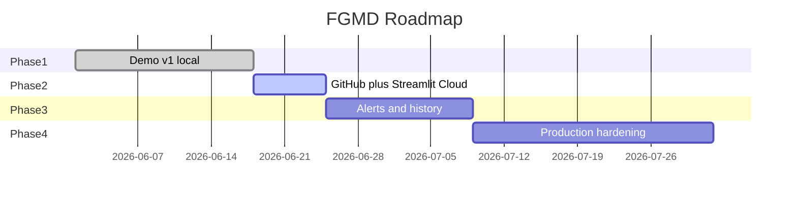

# FGMD Project Development Plan

**Project:** Funeral Goods Management Dashboard (상조물품현황)  
**Stack:** Python 3.12 · Streamlit · Folium · JSON storage  
**Local URL:** http://localhost:8501  
**Status:** Demo v1 complete (local)

---

## 1. Executive Summary

FGMD is a Streamlit dashboard for Samchully-style funeral goods inventory and order management across five Korean regions. Users can view and edit regional stock, see inventory visualized on a South Korea map, and submit orders that generate printable sheets and email notifications.

---

## 2. Completed Work (Phase 1 — Demo v1)

| # | Deliverable | Status | Notes |
|---|-------------|--------|-------|
| 1 | Project scaffold | Done | `app.py`, `config.py`, `services/`, `components/` |
| 2 | Inventory table | Done | Editable per-region stock with 합계 column |
| 3 | South Korea map | Done | Folium map; 1 icon = 10 boxes, fractional scale |
| 4 | Order sheet form | Done | 빈소, 가족관계, 조문객 수 inputs |
| 5 | Box calculation | Done | C < 300 → 1 box; else ceil(C/300) |
| 6 | Warehouse fulfillment | Done | 출고 창고 selection; stock deduction on ORDER |
| 7 | Order persistence | Done | `data/orders.json` |
| 8 | Printable order sheet | Done | HTML download + browser print |
| 9 | SMTP email | Done | Sends to 240027@samchully.co.kr via secrets.toml |
| 10 | Local dev environment | Done | Python 3.12, venv, requirements.txt |

### Architecture (as built)

```
app.py
├── components/inventory_table.py  → load/save inventory.json
├── components/map_view.py         → Folium markers scaled by stock/10
├── components/order_form.py       → validate, order, deduct, email
└── services/
    ├── order_logic.py             → calc_boxes()
    ├── storage.py                 → JSON read/write
    ├── print_service.py           → HTML order sheet
    └── email_service.py           → SMTP with attachment
```

### Regional inventory sites

| Region | Map anchor | Seed stock |
|--------|------------|------------|
| 서울 | Seoul | 120 |
| 오산 | Osan | 85 |
| 전라 | Jeolla | 200 |
| 경상 | Gyeongsang | 150 |
| 충청 | Chungcheong | 95 |

---

## 3. Phase 2 — Deployment & Sharing (Next)

| Task | Priority | Owner | Target |
|------|----------|-------|--------|
| Push code to GitHub | P0 | Dev | This sprint |
| Streamlit Community Cloud deploy | P0 | Dev | Public demo URL |
| Configure production SMTP secrets | P1 | Ops | Streamlit secrets |
| README with setup instructions | P1 | Dev | Repo root |
| CI smoke test (import check) | P2 | Dev | GitHub Actions |

**Note:** Vercel is not suitable for Streamlit (long-running Python server). Recommended host: **Streamlit Cloud** or **Render/Railway**.

---

## 4. Phase 3 — Feature Enhancements

| Feature | Value | Effort |
|---------|-------|--------|
| Low-stock alerts (red map markers) | High | Low |
| Order history panel | High | Low |
| Auto warehouse from 빈소 address | Medium | Medium |
| PDF export with company letterhead | Medium | Medium |
| KPI strip (총 재고, 금일 주문) | Medium | Low |
| Admin auth / role-based access | High | High |
| Database (SQLite/Postgres) | Medium | Medium |
| Audit log for email success/failure | Low | Low |

---

## 5. Phase 4 — Production Hardening

- Move from JSON files to proper database
- Input validation and rate limiting on orders
- HTTPS-only deployment with secrets management
- Monitoring and error alerting
- Backup strategy for inventory and orders
- Integration with internal ERP / logistics APIs

---

## 6. Timeline (Suggested)



---

## 7. How to Run Locally

```powershell
cd C:\Users\SKILLSUPPORT\fgmd
.venv\Scripts\Activate.ps1
streamlit run app.py
```

Open http://localhost:8501

---

## 8. Repository Contents

- `PLAN.md` — Original design plan
- `DEVELOPMENT_PLAN.md` — This document
- `docs/FGMD_Development_Plan.pptx` — Presentation summary
- Application source code and seed data