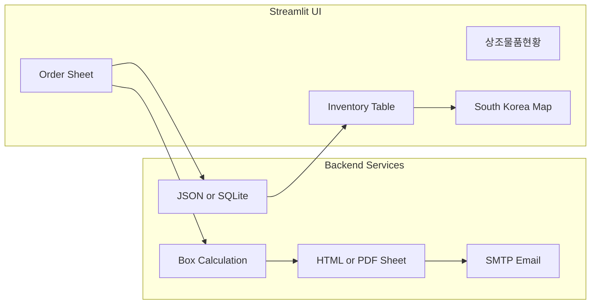

# FGMD Streamlit Dashboard Plan

## Goal

Deliver a single-page Streamlit demo app titled **상조물품현황** that shows regional funeral-goods inventory, visualizes stock on a South Korea map, accepts orders via a form, saves records, produces a printable order sheet, and emails it to `240027@samchully.co.kr` using SMTP credentials from `.streamlit/secrets.toml`.

## Architecture



## Project Layout

| Path | Purpose |
|------|---------|
| `app.py` | Main Streamlit entry, page layout, wiring |
| `config.py` | Region definitions, map coords, constants |
| `services/order_logic.py` | Box-count rule from 조문객 수 |
| `services/storage.py` | Load/save inventory + orders |
| `services/email_service.py` | SMTP send with attachment |
| `services/print_service.py` | Generate printable order sheet |
| `components/inventory_table.py` | Editable stock table with total column |
| `components/order_form.py` | Order inputs + ORDER button |
| `components/map_view.py` | Folium map with scaled box icons |
| `data/inventory.json` | Persisted stock per region |
| `data/orders.json` | Persisted order records |
| `requirements.txt` | Dependencies |
| `.streamlit/secrets.toml.example` | SMTP template for user to copy |

## Implemented Enhancements (post-plan)

- **Editable inventory table** — edit regional stock, save, map updates (1 icon = 10 boxes)
- **Per-warehouse fulfillment** — orders deduct from selected 출고 창고
- **Stock validation** — ORDER disabled when warehouse stock is insufficient

## Run Instructions

```powershell
cd C:\Users\SKILLSUPPORT\fgmd
python -m venv .venv
.venv\Scripts\Activate.ps1
pip install -r requirements.txt
copy .streamlit\secrets.toml.example .streamlit\secrets.toml
streamlit run app.py
```

Local URL: http://localhost:8501